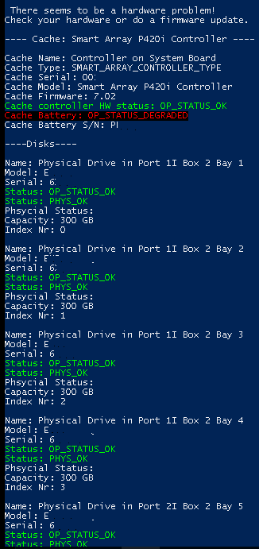

# Get-HPILO
Get's the health status from HP ILO interface and shows a brief overview.  
In case of a problem, it will show more details about the problem and what is causing it. 

The script accepts multiple IP addresses as arguments (comma seperated).  
Before connecting to an IP, you will be prompted with a login. 
It will only read from the HP ILO interface and not write to it. 

If the HPE server is healthy, it will show a brief overview.  
If the HPE server is unhealthy, it will try to find out what is wrong and display it.  

This is made with Rest Method and is tested for ILO 4 - ILO 5  
I did not -yet- use Redfish.  
Supported from Powershell v3.0+ (server 2012 / Windows 8) 
    
A pictures to show some example outputs: 

Executing: 
   

Result in case of no problems:  

Result in case of a problem:  

